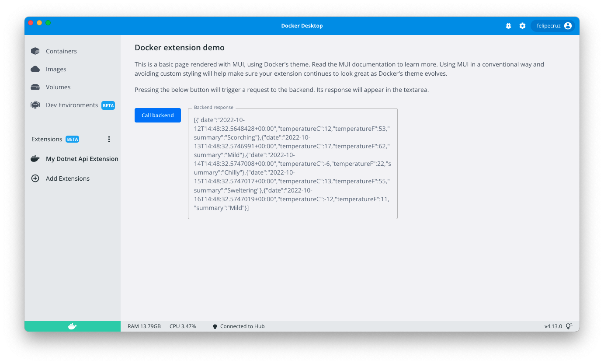

# dotnet-api-docker-extension

A sample .NET 6 WebAPI used as a backend for a Docker Extension.

## What value does this sample bring?

1. The Dockerfile comes with a [stage](Dockerfile#L1-L22) to build and publish the .NET API as a binary.
1. It shows how to use Kestrel (the cross-platform web server for ASP.NET Core) to listen on the unix socket in [Program.cs](vm/MyAPI/Program.cs#L3-L6)
